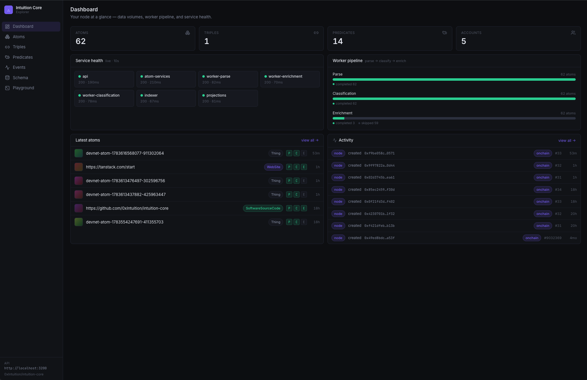
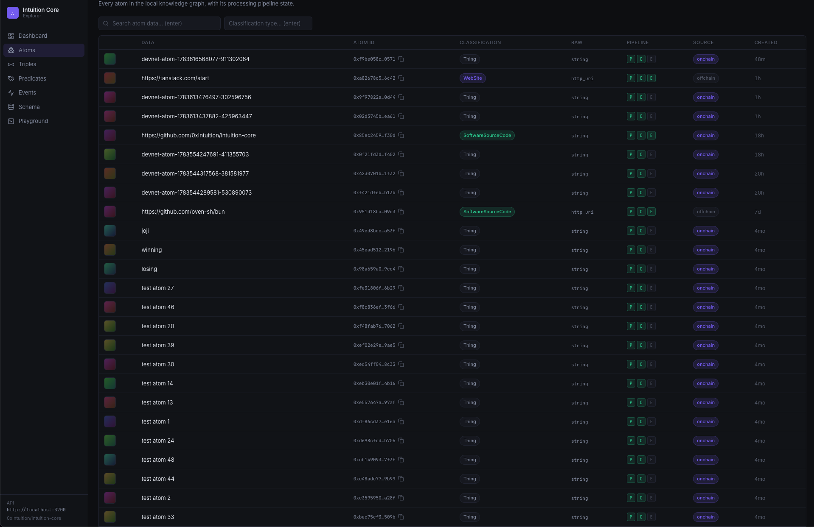
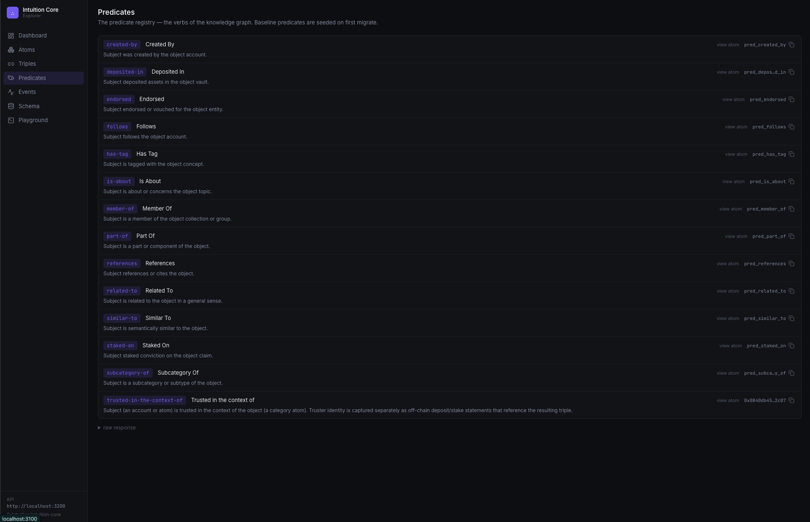

<div align="center">

# Intuition Core

**The open backend, in a box.**

Run your own shard of the world's knowledge graph — a self-hosted indexer,
atom intelligence pipeline, and query API, stood up with one command.

[](./LICENSE)
[](https://bun.sh)
[](./crates)
[](./packages)
[](./docs/architecture.md)

[Quick start](#quick-start) ·
[Docker images](#docker-images) ·
[Explorer](#the-explorer) ·
[How it works](#how-it-works) ·
[API](#the-query-api) ·
[Artifacts](#public-artifacts) ·
[Contracts](./docs/contracts.md) ·
[Docs](./docs) ·
[Contributing](./CONTRIBUTING.md)

</div>

---

The data was always permissionless. **Core makes the machinery permissionless
too.** Until now, the indexer that turns the chain into a queryable graph, the
pipeline that classifies and enriches it, and the API everyone reads it through
ran in one place. Core hands you the whole machine:

- **Index anything** into atoms and triples with **deterministic IDs** — the ID
  you derive locally is the exact ID the protocol registers onchain. Publishing
  is a state change, not a migration.
- **Classify URLs** with 17 built-in plugins (GitHub, Spotify, Wikipedia, X, …)
  and a [plugin API](./docs/writing-a-classification-plugin.md) for domains we
  will never staff.
- **Enrich atoms** with metadata from 36 provider plugins — OpenGraph, JSON-LD,
  Wikipedia, Wikidata work with **no API keys**; [add keys](./docs/enrichment-providers.md)
  for Spotify, TMDB, Etherscan, and more. [Write your own](./docs/writing-an-enrichment-plugin.md).
- **Verify, don't trust** — point the indexer at the chain and reconstruct the
  graph yourself.
- **Watch it live** — a built-in [explorer dashboard](#the-explorer) shows
  service health, the worker pipeline, and every atom's artifacts, triples,
  and events as they land.

The minimal stack needs **zero paid accounts**, including chain indexing (the
Intuition testnet RPC is public and keyless).

[](#the-explorer)

<p align="center"><em>The built-in <a href="#the-explorer">explorer</a>: your node at a glance — live service health, pipeline throughput, and the freshest atoms.</em></p>

## Docker images

Core runs from Docker Compose by default. Local build mode uses the Dockerfiles
in this repository; published-image mode pulls the same runtime services from
GHCR. Compose supplies the datastore URLs for the normal stack, so the required
variables below matter when you run an image directly or override Compose.

Use an immutable SHA tag or a release tag for published-image mode:

```bash
COMPOSE_FILE=docker-compose.yml:docker-compose.published.yml \
  INTUITION_CORE_IMAGE_TAG=sha-REPLACE_WITH_12_CHAR_SHA \
  docker compose up -d
```

For production or incident reproduction, pin each service by digest instead of
using a moving tag:

```bash
export INTUITION_CORE_API_IMAGE=ghcr.io/0xintuition/intuition-core-api@sha256:...
export INTUITION_CORE_ATOM_SERVICES_IMAGE=ghcr.io/0xintuition/intuition-core-atom-services@sha256:...
export INTUITION_CORE_WORKERS_IMAGE=ghcr.io/0xintuition/intuition-core-workers@sha256:...
export INTUITION_CORE_RINDEXER_INGESTION_IMAGE=ghcr.io/0xintuition/intuition-core-rindexer-ingestion@sha256:...
export INTUITION_CORE_PROJECTIONS_IMAGE=ghcr.io/0xintuition/intuition-core-projections@sha256:...
export INTUITION_CORE_TIMESCALE_MIGRATIONS_IMAGE=ghcr.io/0xintuition/intuition-core-timescale-migrations@sha256:...
export COMPOSE_FILE=docker-compose.yml:docker-compose.published.yml

docker compose up -d
```

### Core-built images

| Image | Purpose | Required env when run directly |
| --- | --- | --- |
| [`ghcr.io/0xintuition/intuition-core-api`](https://github.com/0xIntuition/intuition-core/pkgs/container/intuition-core-api) | Query and write API over the KG database. Compose also reuses this image for the one-shot KG migration job. | `DATABASE_KG_URL`. Optional: `API_PORT`, `API_AUTH`, `API_ALLOWED_ORIGINS`, `API_RATE_LIMIT_RPM`, `API_TRUST_PROXY`. |
| [`ghcr.io/0xintuition/intuition-core-atom-services`](https://github.com/0xIntuition/intuition-core/pkgs/container/intuition-core-atom-services) | Stateless HTTP service for atom classification, enrichment, and combined processing. | None for the keyless provider set. Optional: `ATOM_SERVICES_PORT`, `ATOM_SERVICES_AUTH_TOKEN`, rate-limit/cache/preset variables, provider keys listed below. |
| [`ghcr.io/0xintuition/intuition-core-workers`](https://github.com/0xIntuition/intuition-core/pkgs/container/intuition-core-workers) | Background KG node pipeline. Run with `kg-parse-worker`, `kg-classification-worker`, or `kg-enrichment-worker`. | `DATABASE_KG_URL`. Optional: `WORKERS_PORT`, per-mode health ports, concurrency/retry/cache/preset variables, provider keys listed below. |
| [`ghcr.io/0xintuition/intuition-core-rindexer-ingestion`](https://github.com/0xIntuition/intuition-core/pkgs/container/intuition-core-rindexer-ingestion) | MultiVault chain ingestion into the Timescale event store. Used by the `indexing` Compose profile. | `DATABASE_URL`, `INTUITION_RPC_URL`, `CHAIN_ID`, `MULTIVAULT_CONTRACT_ADDRESS`, `MULTIVAULT_START_BLOCK`. Optional: `MULTIVAULT_END_BLOCK`, `RINDEXER_HEALTH_PORT`, `METRICS_PORT`. |
| [`ghcr.io/0xintuition/intuition-core-projections`](https://github.com/0xIntuition/intuition-core/pkgs/container/intuition-core-projections) | Event-store projections into read models and KG tables. Used by the `indexing` Compose profile. | `DATABASE_URL`. Set `DATABASE_KG_URL` to write `kg.nodes` and `kg.events`; Compose sets it. Optional: `SURREAL_DB_URL`, `PROJECTIONS_METRICS_PORT`, `ENABLED_PROJECTIONS`, `DISABLED_PROJECTIONS`, pool and interval tuning variables. |
| [`ghcr.io/0xintuition/intuition-core-timescale-migrations`](https://github.com/0xIntuition/intuition-core/pkgs/container/intuition-core-timescale-migrations) | One-shot Timescale migration runner for `migrations/timescale/*.sql`. | `DATABASE_URL`. |
| [`intuition-core-devnet-deployer`](./docker/Dockerfile.devnet) | Local-only one-shot deployer for the devnet Anvil profile. It writes `devnet/deployments-devnet.json`; this image is not published to GHCR. | `RPC_URL`, `STATE_FILE` when run outside the provided `devnet-deploy` Compose service. |

Provider and cache keys are optional. Without them, keyless providers still run
and paid/API-backed plugins skip or degrade gracefully:

```text
GITHUB_TOKEN
SPOTIFY_CLIENT_ID
SPOTIFY_CLIENT_SECRET
SPOTIFY_MARKET
ETHERSCAN_API_KEY
TMDB_API_KEY
COINGECKO_API_KEY
YOUTUBE_API_KEY
GOOGLE_PLACES_API_KEY
X_BEARER_TOKEN
BRANDFETCH_API_KEY
PODCAST_INDEX_API_KEY
PODCAST_INDEX_API_SECRET
CANOPY_API_KEY
UPSTASH_REDIS_REST_URL
UPSTASH_REDIS_REST_TOKEN
```

### Supporting images

| Image | Purpose | Compose env |
| --- | --- | --- |
| [`timescale/timescaledb-ha:pg17`](https://hub.docker.com/r/timescale/timescaledb-ha) | Runs both `postgres-kg` and `timescale`. The image includes TimescaleDB, pgvector, and PostGIS. | `POSTGRES_USER`, `POSTGRES_PASSWORD`, `POSTGRES_DB`; host ports are controlled by `POSTGRES_KG_HOST_PORT` and `TIMESCALE_HOST_PORT`. |
| [`redis:7-alpine`](https://hub.docker.com/_/redis) | Redis for indexer leader election. | No required env; host port is controlled by `REDIS_HOST_PORT`. |
| [`ghcr.io/foundry-rs/foundry:stable`](https://github.com/foundry-rs/foundry/pkgs/container/foundry) | Anvil chain for the optional local `devnet` profile. | No required env; Compose passes the command and stores chain state in the `anvil_data` volume. |

See [Container Images](./docs/container-images.md) for publishing rules,
artifact verification, digest examples, and the published-image smoke checklist.

## Quick start

> Prerequisites: [Docker](https://docs.docker.com/get-docker/) and
> [Bun](https://bun.sh) ≥ 1.3.

```bash
git clone https://github.com/0xIntuition/intuition-core && cd intuition-core
scripts/bootstrap.sh
```

The bootstrap script checks Docker, Bun, free disk space, creates `.env` from
`example.env` when needed, installs dependencies, starts Docker Compose, waits
for the API health check, then prints the first useful API commands.

Prefer Make?

```bash
make bootstrap
```

### Your first 5 minutes

Start the local stack:

```bash
scripts/bootstrap.sh
# or: make bootstrap
```

Expected shape:

```text
OK Docker and Docker Compose are available
OK Created .env from example.env
==> Installing workspace dependencies
==> Starting Docker Compose
OK API is healthy
Try the API:
  curl http://localhost:3000/health
  curl http://localhost:3000/api/stats
  curl http://localhost:3000/api/predicates
```

Check that the read API is live:

```bash
curl http://localhost:3000/health
curl http://localhost:3000/api/stats
curl http://localhost:3000/api/predicates
```

Expected response shapes:

```json
{ "status": "ok" }
```

```json
{ "data": { "atoms": 0, "triples": 0, "accounts": 0, "predicates": 14 } }
```

```json
{ "data": [{ "slug": "created-by", "label": "Created By", "...": "..." }] }
```

Mint a write key. Prefer the Make target because it supplies the host Postgres
connection string that the key script requires:

```bash
make keys ACCOUNT=0x0000000000000000000000000000000000000001 KEY_NAME=me
```

Expected shape:

```text
created key_... (me) -> account 0x0000000000000000000000000000000000000001, write=true, rpm=default

  ik_...

Store this key now - it is not recoverable.
```

Create an atom with the printed `ik_...` key:

```bash
API_KEY=ik_...

curl -X POST http://localhost:3000/api/atoms \
  -H "Authorization: Bearer $API_KEY" \
  -H 'Content-Type: application/json' \
  -d '{"input":"https://github.com/oven-sh/bun"}'
```

Expected shape:

```json
{
  "data": {
    "id": "0x...",
    "created": true,
    "createdBy": "0x0000000000000000000000000000000000000001"
  }
}
```

Read it back:

```bash
ATOM_ID=0x...

curl "http://localhost:3000/api/atoms/$ATOM_ID"
curl "http://localhost:3000/api/atoms?limit=5"
```

Expected single-atom shape:

```json
{
  "data": {
    "id": "0x...",
    "rawType": "http_uri",
    "classificationType": "...",
    "parseStatus": "completed",
    "classificationStatus": "completed",
    "enrichmentStatus": "completed"
  }
}
```

Expected list shape:

```json
{
  "data": [{ "id": "0x...", "rawType": "http_uri", "...": "..." }],
  "pagination": { "limit": 5, "offset": 0, "count": 1 }
}
```

Workers may briefly show `pending` before those statuses become `completed`.

If the first run fails, check these five things first:

1. `curl http://localhost:3000/health` returns `{"status":"ok"}`.
2. Writes returning `401 api_key_required` need a key from `make keys`.
3. Port conflicts on `3000`, `4010`, or `4110` need the other process stopped
   or `API_PORT` / `ATOM_SERVICES_PORT` / `WORKERS_PORT` overrides.
4. Postgres `TimeZone` errors usually mean a corrupt Timescale Docker image;
   see [troubleshooting](./docs/troubleshooting.md#invalid-value-for-parameter-timezone-utc-from-postgres).
5. Empty indexed tables usually mean the indexing profile has not run yet, or
   the configured block window does not contain MultiVault events.

Verify the local stack end to end:

```bash
make smoke        # API key → atom → workers → triple → stats
make smoke-index  # 500-block public testnet indexing window → projections → API stats
```

Smoke commands run their own disposable Compose projects with random host ports,
so they can run while your normal `docker compose up` stack is still running.

Explore the local database after bootstrapping or indexing:

```bash
make explore      # table counts, recent atoms, pipeline status, predicates, artifacts
bun run explore
```

Raw commands still work:

```bash
cp example.env .env
bun install
docker compose up        # databases → migrations → seeds → workers → API
```

To run from published GHCR images instead of local builds:

```bash
make up-published IMAGE_TAG=vX.Y.Z
make smoke-published IMAGE_TAG=vX.Y.Z
```

Published-image Make targets require an explicit tag. Use digest pins instead
of tags for production or reproducible release verification. See
[container image details](./docs/container-images.md#running-published-images).

Prefer native services with a TUI? Install
[`process-compose`](https://f1bonacc1.github.io/process-compose/installation/)
and run the local profile:

```bash
bun run dev:local -- standard
```

This keeps datastores in Docker, then runs KG migrations, Timescale migrations,
the API, workers, and atom-services as local processes with logs under
`.logs/process-compose/`.

To add the Rust indexing tier, set the chain variables in `.env` (see
[run your own node](./docs/run-your-own-node.md#5-index-the-chain)), then run:

```bash
bun run dev:local -- indexing
```

Use `bun run dev:local:dry-run -- indexing` to validate the merged
Process Compose config without starting services. Dry-run does not check native
indexing prerequisites; starting `indexing` also needs Rust/Cargo, `envsubst`
(`brew install gettext` on macOS), and valid chain variables.

**Create your first atom** (mint a key once, then post anything — a URL,
string, or JSON):

```bash
make keys ACCOUNT=0x0000000000000000000000000000000000000001 KEY_NAME=me
# → ik_… (printed once — store it)

curl -X POST localhost:3000/api/atoms \
  -H "Authorization: Bearer ik_…" -H 'Content-Type: application/json' \
  -d '{"input":"https://github.com/oven-sh/bun"}'
```

```json
{ "data": { "id": "0x951d18ba…", "created": true, "createdBy": "0xYourWallet" } }
```

Seconds later the workers have parsed, classified, and enriched it:

```bash
curl localhost:3000/api/atoms/0x951d18ba…
# → "classificationType": "SoftwareSourceCode",
#   parse/classify/enrich: "completed", artifacts: opengraph · favicon · github-repo
```

**Or skip the database entirely** — stateless classify/enrich over HTTP:

```bash
curl -X POST localhost:4010/v1/classify -H 'Content-Type: application/json' \
  -d '{"input":"https://github.com/vercel/next.js"}'
# → { "domain": "github", "subtype": "repo", "confidence": 0.97 }
```

**Index the chain** — add the chain config to `.env`
([details](./docs/run-your-own-node.md#5-index-the-chain)), then:

```bash
docker compose --profile indexing up
```

A bounded test window (`MULTIVAULT_END_BLOCK`) indexes 2,000 blocks of real
events in under a second once synced — atoms land in your graph, classified and
queryable, with full market read models alongside.

Full walkthrough: **[docs/run-your-own-node.md](./docs/run-your-own-node.md)**.

Data reference: **[docs/data-model.md](./docs/data-model.md)**.
SQL cookbook: **[docs/example-queries.md](./docs/example-queries.md)**.

## The explorer

Your node is not a black box. **`apps/explorer`** is a dashboard-first data
explorer that ships with Core — and the **reference consumer of the public
API**: everything it renders comes through the same REST endpoints your app
would use, via one readable
[typed client](./apps/explorer/src/lib/api.ts) that doubles as documentation.

```bash
cd apps/explorer && bun run dev     # → http://localhost:3100
```

- **Dashboard** — live service health across all seven services, worker-pipeline
  throughput (parse → classify → enrich), data volumes, and an activity feed.
- **Atoms** — every atom with its classification, pipeline state, and onchain
  provenance; detail pages surface raw + resolved data, **enrichment artifacts**
  (with extracted images), associated **triples** with the atom's position
  highlighted, graph degree, and per-atom events.



- **Triples & predicates** — claims rendered as linked subject → predicate →
  object chips with resolved labels, and the seeded predicate registry.
- **Playground** — create atoms and triples through the public API, with the
  exact `curl` equivalent shown for every request.
- **Events & schema** — the append-only activity log and the live data model
  from `GET /api/schema`.



### Run everything — chain → indexer → API → explorer

The full self-contained loop: a local chain with the real contracts, the
indexer reconstructing the graph from it, the intelligence pipeline enriching
every atom, and the explorer to watch it all happen.

```bash
# 1. Chain + contracts (anvil with the production bytecode, deployed from npm)
docker compose --profile devnet up -d anvil devnet-deploy

# 2. Point the indexer at it — in .env:
#      INTUITION_RPC_URL=http://anvil:8545
#      CHAIN_ID=31337
#      MULTIVAULT_CONTRACT_ADDRESS=0xa85233C63b9Ee964Add6F2cffe00Fd84eb32338f
#      MULTIVAULT_START_BLOCK=0
docker compose --profile devnet --profile indexing up -d

# 3. The explorer
cd apps/explorer && bun run dev     # → http://localhost:3100
```

Create atoms onchain (`docs/local-devnet.md#3-create-atoms-onchain`) or through
the explorer's **Playground**, and watch them land in the graph — indexed,
parsed, classified, enriched — within seconds.

> Ports: the API publishes on `3000` by default (`API_HOST_PORT` overrides it —
> then set `VITE_API_URL` for the explorer). If you set `API_ALLOWED_ORIGINS`,
> include `http://localhost:3100`.

**Deploy your own testnet instance** — the same deployer stands up a fresh,
self-owned protocol deployment on Intuition Sepolia (chain 13579), then prints
the `.env` block that points your indexer at it:

```bash
PRIVATE_KEY=0x… bun run testnet:deploy
```

Details: **[docs/local-devnet.md](./docs/local-devnet.md)**.

## How it works

```
                     ┌──────────────────────────────────────────────┐
   Intuition chain   │  indexer (Rust) — decode MultiVault events   │──► TimescaleDB
   (any MultiVault)  └──────────────────┬───────────────────────────┘    event store
                                        ▼
                     ┌──────────────────────────────────────────────┐
                     │  projections (Rust) — ~20 checkpointed       │──► market read models
                     │  workers; core_entities → atoms into the KG ─┼──► Postgres-KG
                     └──────────────────────────────────────────────┘         ▲
   POST /api/atoms ────────────────────────────────────────────────────────────┤
                     ┌──────────────────────────────────────────────┐          │
                     │  workers (Bun) — parse → classify → enrich   │──────────┘
                     └──────────────────────────────────────────────┘
                     ┌──────────────────────────────────────────────┐
                     │  api (Hono) — query the graph you built      │◄── Postgres-KG
                     └──────────────────────────────────────────────┘
```

| Component | Where | What it does |
| --- | --- | --- |
| **indexer** | `crates/rindexer-ingestion` | chain events → append-only event store (bounded ranges supported) |
| **projections** | `crates/projections` | events → vaults, positions, signals + atoms/triples into the KG |
| **workers** | `services/workers` | lease-based parse → classify → enrich over every new atom |
| **api** | `services/api` | REST reads + key-gated, attributed writes |
| **atom-services** | `services/atom-services` | stateless `POST /v1/classify` · `/v1/enrich` · `/v1/process` |
| **atom intelligence** | `packages/atom-*` | the parser, 17 classification plugins, enrichment adapters, rules engine |
| **data layer** | `packages/database-*`, `migrations/` | schemas + versioned, auto-applied migrations |
| **protocol surface** | `packages/contracts` | pinned [`@0xintuition/contracts-v2`](https://www.npmjs.com/package/@0xintuition/contracts-v2) ABIs, address book, devnet deployer |
| **explorer** | `apps/explorer` | dashboard + data explorer — service health, pipeline status, atoms/triples/artifacts; the reference API consumer |

Deep dive: **[docs/architecture.md](./docs/architecture.md)**.

## The query API

Reads are open. Writes need an operator-minted API key and are **attributed to
the key's account** (`created_by`). Three modes via `API_AUTH`:
`public-read` (default) · `gated` · `open`.

| Endpoint | | 
| --- | --- |
| `POST /api/atoms` 🔑 | any URL/string/JSON → deterministic, idempotent atom |
| `POST /api/triples` 🔑 | claim between terms → deterministic, idempotent triple |
| `GET /api/atoms` · `/api/atoms/:id` | list (filter/search) and fetch atoms |
| `GET /api/atoms/:id/triples` | every triple touching an atom, any position (hexastore) |
| `GET /api/triples` · `/api/triples/:id` | filter by subject / predicate / object |
| `GET /api/predicates` · `/api/schema` · `/api/stats` · `/health` | registry, KG schema metadata, counts, liveness |

Requests, responses, and error shapes: **[docs/api-reference.md](./docs/api-reference.md)**.
OpenAPI 3.1 spec: **[docs/openapi.yaml](./docs/openapi.yaml)**.

## Configuration tiers

Capabilities are opt-in; the floor is free.

| Tier | Adds | Paid accounts |
| --- | --- | --- |
| **Minimal** (`docker compose up`) | databases + workers + api + atom-services | **none** |
| **+ Indexing** (`--profile indexing`) | indexer + projections | none — public RPC |
| **+ Local devnet** (`--profile devnet`) | [Anvil + the real contracts](./docs/local-devnet.md) — production bytecode from [`@0xintuition/contracts-v2`](https://www.npmjs.com/package/@0xintuition/contracts-v2), your own chain, fully offline | none |
| **+ Rich enrichment** | provider plugins | optional keys (Spotify, Etherscan, …) |
| **+ Search** *(coming)* | embeddings | OpenAI or pluggable provider |

Every variable: **[docs/configuration.md](./docs/configuration.md)**.

## Public artifacts

Core is moving from source-only distribution to verified public artifacts.

| Artifact | Status | Notes |
| --- | --- | --- |
| `intuition-curves` | crates.io-ready | Bonding-curve parity library. Package name is public; Rust imports remain `curves`. |
| Service crates | source-only | Runtime crates stay in source and image form until public API boundaries are split. |
| API/workers/atom-services images | GHCR workflow | Published by tag/digest; `docker-compose.published.yml` runs them without local builds. |
| Indexer/projections/migration images | GHCR workflow | Published by tag/digest; bounded indexing smoke verifies ingestion and projections. |

Release process: **[docs/release-process.md](./docs/release-process.md)**.
Container image details: **[docs/container-images.md](./docs/container-images.md)**.
v2 migration map: **[docs/v2-migration-map.md](./docs/v2-migration-map.md)**.
Rust crate details: **[crates/README.md](./crates/README.md)**.
Scoped indexing plan: **[docs/indexing-scope.md](./docs/indexing-scope.md)**.

## Repository layout

```
intuition-core/
├─ apps/            web apps — explorer (dashboard + data explorer on :3100)
├─ crates/          Rust — shared · rindexer-ingestion · projections · curves
├─ packages/        TypeScript libraries — atom-* intelligence · database schemas · contracts · types
├─ services/        deployable services — api · workers · atom-services
├─ migrations/      event-store SQL migrations (TimescaleDB)
├─ docker/          per-service Dockerfiles
├─ docs/            guides — start with run-your-own-node.md
└─ docker-compose.yml           ← the one button
```

## Development

```bash
bun install                    # Bun only — enforced by preinstall
bun run typecheck              # all workspaces
bun run test                   # bun:test suites (14 packages)
bunx @biomejs/biome check .    # lint + format
cargo check --workspace        # the Rust crates
node scripts/guard-supply-chain-policy.mjs
```

Read [CONTRIBUTING.md](./CONTRIBUTING.md) first — especially the parts about
**deterministic IDs being identity-sensitive** and the enforced auth boundary.
Something broken? [docs/troubleshooting.md](./docs/troubleshooting.md) covers
the failure modes we've actually hit.

## What stays out

Core is the open, auth-free backend. User authentication, billing, and the
social product layer live in Intuition's private monorepo — a lint rule fails
CI if they're ever imported here. Bring your own front end; the graph is yours.

## License

MIT © [Intuition Systems](https://intuition.systems)
