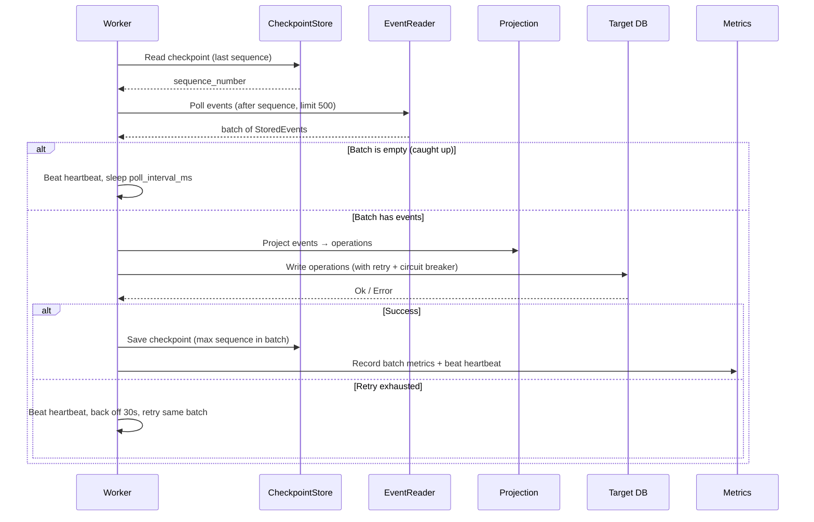
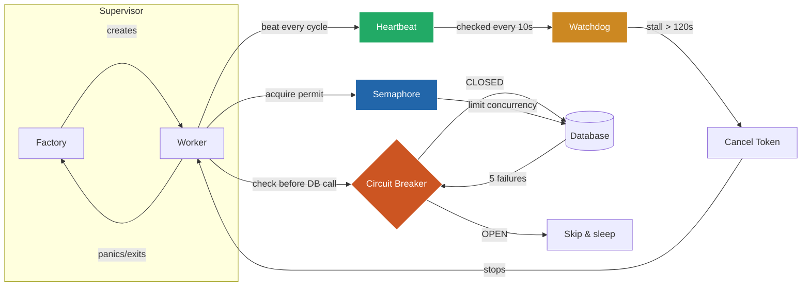
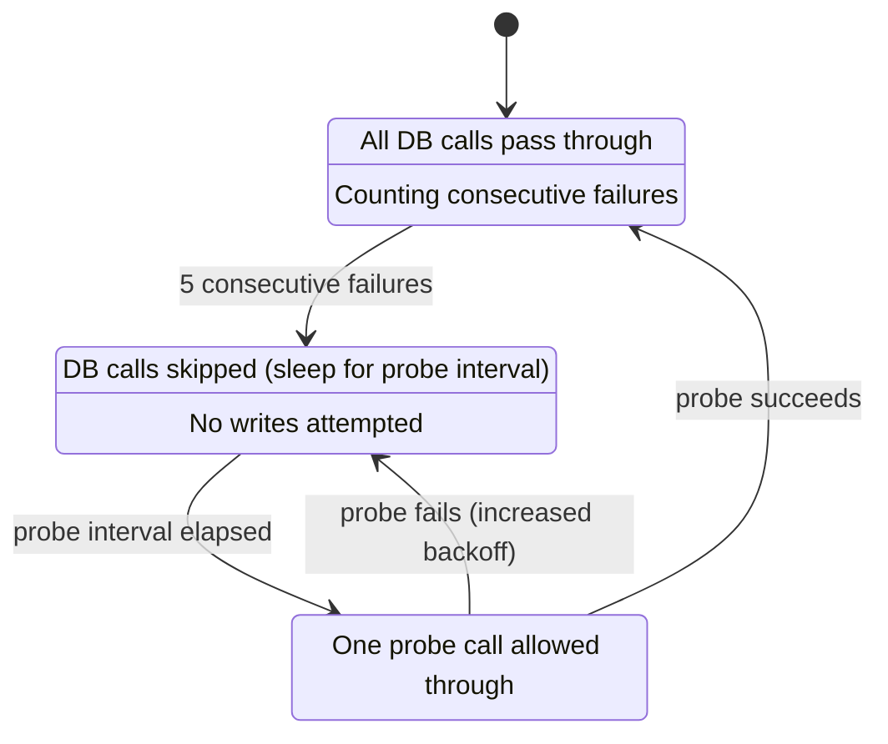
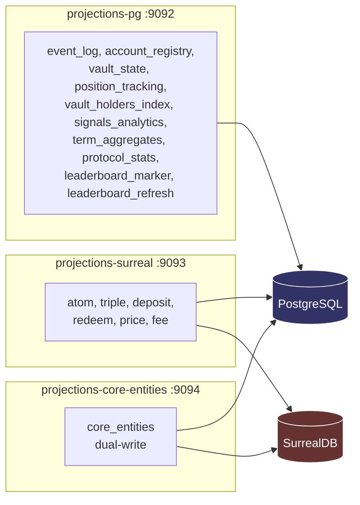

# Projections Service

The projections service is a long-running Rust binary that continuously reads blockchain events from a PostgreSQL event store, transforms them into derived state, and writes results to PostgreSQL (with TimescaleDB) and SurrealDB. It is the bridge between the raw event log (populated by the rindexer ingestion pipeline) and the queryable read models that power the Intuition API.

For how projection outputs map onto the datastores, see [`docs/architecture.md`](../../docs/architecture.md).

## Table of Contents

- [Architecture Overview](#architecture-overview)
- [Worker Types](#worker-types)
- [Event Ordering](#event-ordering)
- [Data Flow](#data-flow)
- [Module Map](#module-map)
- [Core Abstractions](#core-abstractions)
  - [Projection Trait (SurrealDB)](#projection-trait-surrealdb)
  - [PgProjection Trait](#pgprojection-trait)
  - [BatchProjection Trait](#batchprojection-trait)
  - [SinkOperation Enum](#sinkoperation-enum)
  - [ProjectionSink Trait](#projectionsink-trait)
- [Projections Reference](#projections-reference)
  - [SurrealDB Projections](#surrealdb-projections)
  - [Dual-Write Projection](#dual-write-projection)
  - [PostgreSQL Direct Projections](#postgresql-direct-projections)
  - [Batch Projections](#batch-projections)
- [Table Ownership](#table-ownership)
- [PostgreSQL / TimescaleDB Schema](#postgresql--timescaledb-schema)
- [SurrealDB Schema](#surrealdb-schema)
- [Numeric Precision](#numeric-precision)
- [Transactional Guarantees](#transactional-guarantees)
- [Error Handling](#error-handling)
- [Checkpointing and Resumption](#checkpointing-and-resumption)
- [Observability](#observability)
- [Configuration](#configuration)
- [Operations](#operations)
- [Migrations](#migrations)
- [Adding a New Projection](#adding-a-new-projection)
- [Adding a New Sink](#adding-a-new-sink-extending-to-other-databases)
- [Testing](#testing)

---

## Architecture Overview

```
                         PostgreSQL (event_store)
                                  |
                                  v
                         +-----------------+
                         |  EventReader    |  Reads batches of StoredEvent
                         +-----------------+  filtered by event_type
                                  |
                                  v
    +------------------------------------------------------------------------+
    |                        Coordinator                                     |
    |  Spawns workers across four worker types:                              |
    |  - Worker (SurrealDB via SinkOperation)                                |
    |  - PgWorker (direct PostgreSQL)                                        |
    |  - CoreEntitiesWorker (dual-write to SurrealDB + PG)                   |
    |  - BatchWorker (timer-driven, no event stream)                         |
    +------------------------------------------------------------------------+
         |                  |                  |                  |
         v                  v                  v                  v
    +-----------+    +-------------+    +--------------+    +------------+
    | SurrealDB |    | PG Direct   |    | Core         |    | Batch      |
    | Workers   |    | Workers     |    | Entities     |    | Workers    |
    | (6)       |    | (9+shards)  |    | Worker (1)   |    | (1)        |
    +-----------+    +-------------+    +--------------+    +------------+
         |                  |                  |                  |
         v                  v                  v                  v
    SurrealDB         PostgreSQL        SurrealDB + PG      PostgreSQL
```

**Projection implementations: 17** (6 SurrealDB + 9 PG-direct + 1 dual-write + 1 batch).

> **Note on sharding:** `vault_state` and `position_tracking` are sharded projections. With the default `POSITION_TRACKING_SHARDS=4`, each spawns 4 workers (one per shard), so the actual worker count at default config is **21** (6 SurrealDB + 13 PG-direct + 1 dual-write + 1 batch). With `POSITION_TRACKING_SHARDS=1` (e.g. in E2E tests), it's 17.

---

## Worker Types

| Worker Type | Trait | Sink | Checkpoint | Description |
|-------------|-------|------|------------|-------------|
| `Worker` | `Projection` | SurrealDB via `SinkOperation` | `{name}:surrealdb` | Transforms events into graph operations |
| `PgWorker` | `PgProjection` | Direct `sqlx::query` | `{name}:pg` | Writes directly to PostgreSQL tables |
| `CoreEntitiesWorker` | Custom | SurrealDB + PG | `core_entities:dual` | Dual-writes atoms/triples to both databases |
| `BatchWorker` | `BatchProjection` | Direct PG | Timer-driven (no checkpoint) | Runs on a fixed interval, not event-driven |

---

## Event Ordering

> **Important**: This indexer does **not** process events in on-chain chronological order. Events are batched by `event_type` -- each worker only reads its own event type(s). Within a single worker's stream, events are ordered by `sequence_number` (the order they were ingested), which generally follows chain order but is **not** interleaved across event types.
>
> If you need to reconstruct the exact on-chain ordering of events, sort by `(block_number, log_index)` or use `block_timestamp` -- do **not** rely on `sequence_number` across different event types.

## Data Flow

A single cycle of an event-driven worker:



---

## Module Map

```
src/
  main.rs                  Entry point: DB connections, projection registration, worker spawning
  config.rs                Environment-based configuration (ProjectionsConfig)
  error.rs                 Crate-wide error enum (ProjectionError)
  coordinator.rs           Top-level orchestrator: spawns workers inside supervisors + watchdog
  metrics.rs               Prometheus metrics, health endpoints (/health/ready, /live, /startup)
  util.rs                  Lightweight PRNG for backoff jitter
  shard.rs                 Sharding utilities for vault_state + position_tracking

  worker/                  # Poll loops that drive projections through the event log
    surreal.rs             SurrealDB worker: events → SinkOperation → SurrealDB sink
    pg.rs                  PostgreSQL worker: events → PgProjection::process_batch → sqlx
    batch.rs               Timer-driven worker (e.g. leaderboard refresh every 30s)
    core_entities.rs       Dual-write worker: events → SurrealDB + PostgreSQL

  event/                   # Event reading from PostgreSQL
    source.rs              EventSource trait (abstraction over readers)
    reader.rs              Monolithic reader (reads from event_store table)
    typed_reader.rs        Per-type reader (reads from typed event tables)

  resilience/              # Fault-tolerance infrastructure
    circuit_breaker.rs     CLOSED→OPEN→HALF-OPEN state machine (2 shared: PG + SurrealDB)
    retry.rs               Shared retry loop, WorkerConfig, RetryPolicy, backoff jitter
    supervisor.rs          Automatic restart with backoff on panic/exit (factory pattern)
    supervised_adapters.rs Bridges consuming worker.run(self) to SupervisedWorker trait
    watchdog.rs            Heartbeat-based stall detection (120s threshold, 10s check)
    connection_manager.rs  PG pool partitioning (Semaphore) + SurrealDB auto-reconnect
    checkpoint.rs          Reads/writes per-worker checkpoints in PostgreSQL

  projection/              # Business logic: event → derived state
    mod.rs                 Shared helpers + all_projections() factory
    traits.rs              Projection, PgProjection, BatchProjection traits

    surreal/               # SurrealDB projections (→ SinkOperation → SurrealDB)
      atom.rs              AtomCreated → account + vault + atom nodes
      triple.rs            TripleCreated → account + vault + triple nodes
      deposit.rs           Deposited → account, deposit edge, position, vault
      redeem.rs            Redeemed → account, withdraw edge, position, vault
      price.rs             SharePriceChanged → vault price update
      fee.rs               ProtocolFeeAccrued → account node upsert

    dual/                  # Dual-write projection (SurrealDB + PostgreSQL)
      core_entities.rs     AtomCreated + TripleCreated → SurrealDB + PG term table

    timescaledb/           # PostgreSQL-direct projections (→ sqlx → PG)
      event_log.rs         All events → event + deposit/redemption/fee fact tables
      account_registry.rs  All events → account table (address registry)
      vault_state.rs       Deposited + Redeemed + SharePriceChanged → vault + share_price_history
      position_tracking.rs Deposited + Redeemed → position + position_change
      vault_holders_index.rs Deposited + Redeemed → active_vault_position
      signals_analytics.rs Deposited + Redeemed → signal
      term_aggregates.rs   TripleCreated + SharePriceChanged → term_summary + term_market_cap_history
      protocol_stats.rs    All events → stats singleton
      leaderboard_marker.rs Deposited + Redeemed + SharePriceChanged → dirty sets + account_stats
      leaderboard_refresh.rs Periodic PnL recomputation from dirty sets → account_pnl_state

  repo/                    # SQL helper functions for complex projection queries
    vault_repo.rs          Vault upsert, price update, holder count
    position_repo.rs       Position upsert on deposit/redeem, position_change
    leaderboard_repo.rs    PnL computation, cache refresh

  sink/                    # Database write abstraction
    mod.rs                 SinkOperation enum, RecordId, ProjectionSink trait
    surreal.rs             SurrealDB sink: SurrealQL compilation + auto-reconnecting WebSocket
```

---

## Core Abstractions

### Sealed Newtypes (`ParsedEvent`)

Every event flowing through the pipeline is parsed **once** by the worker into a typed [`ParsedEvent`] variant (`AtomCreated`, `TripleCreated`, `Deposited`, `Redeemed`, `SharePriceChanged`, `ProtocolFeeAccrued`, or `Unknown`). Projections never call `get_str()` / `parse_decimal()` on raw `serde_json::Value` — they receive pre-validated `BigDecimal`s and `&str` fields from typed records like `DepositedRecord`, `AtomCreatedRecord`, etc. (defined in `shared/src/parsed_event.rs`).

Key guarantees:

- **`ParsedEvent::parse_or_unknown(event)`** never drops events. A typed-parse failure produces `ParsedEvent::Unknown(raw)` so the projection can still fall back to raw field extraction instead of silently swallowing bad data.
- **Projections implement `process_parsed_batch` (PG) or `project_parsed` (Surreal)** as the primary entry point. The raw `process_batch` / `project` methods are 4-line shims that call `ParsedEvent::parse_or_unknown` once per event and delegate to the typed path — raw and typed paths are **provably identical**, enforced by parity tests (`assert_surreal_projection_parity`).
- **`uses_typed_events() -> bool`** returns `true` on every migrated projection so the worker knows to call the typed entry point directly, skipping the shim.
- **Exhaustive classification** via `ErrorClass` and `ProjectionError::classify()` (no `_ =>` wildcard) forces a control-flow decision at compile time whenever a new error variant is added.

See [`crates/shared/src/parsed_event.rs`](../shared/src/parsed_event.rs) for the full sealed-newtype definitions and the "Parse once, type-check everywhere" design principle: events are decoded into sealed types exactly once at ingestion.

### Projection Trait (SurrealDB)

```rust
pub trait Projection: Send + Sync + 'static {
    fn event_types(&self) -> &'static [EventType];
    fn name(&self) -> &str;

    /// Primary typed entry point — receives a pre-parsed `ParsedEvent`.
    fn project_parsed(&self, event: &ParsedEvent) -> Result<Vec<SinkOperation>, ProjectionError>;

    /// Raw entry point — default impl parses once via `ParsedEvent::parse_or_unknown`
    /// and delegates to `project_parsed`.
    fn project(&self, event: &StoredEvent) -> Result<Vec<SinkOperation>, ProjectionError> { /* shim */ }

    /// Migration gate: `true` once the projection consumes typed events.
    fn uses_typed_events(&self) -> bool { false }
}
```

Projections are **stateless, synchronous, and pure**. They receive a pre-parsed typed event and return database-agnostic operations. Trivially unit-testable without any database connection. Every Surreal projection (`atom`, `triple`, `deposit`, `redeem`, `price`, `fee`) and the `core_entities` dual-write projection return `uses_typed_events() == true`.

### PgProjection Trait

```rust
#[async_trait]
pub trait PgProjection: Send + Sync + 'static {
    fn name(&self) -> &str;
    fn event_types(&self) -> &'static [EventType];

    /// Primary typed entry point — receives a slice of pre-parsed `ParsedEvent`s.
    async fn process_parsed_batch(&self, pool: &PgPool, events: &[ParsedEvent]) -> Result<(), ProjectionError>;

    /// Raw entry point — default impl parses each event once and delegates.
    async fn process_batch(&self, pool: &PgPool, events: &[StoredEvent]) -> Result<(), ProjectionError> { /* shim */ }

    fn uses_typed_events(&self) -> bool { false }
    fn shard_id(&self) -> Option<u32> { None }
}
```

Unlike the SurrealDB `Projection` trait, `PgProjection` writes directly to PostgreSQL via `sqlx::query` inside `process_parsed_batch`. This avoids the `SinkOperation` indirection for projections that only target PG. Each implementation wraps its batch in a single database transaction. All nine PgProjections (`event_log`, `position_tracking`, `vault_state`, `account_registry`, `vault_holders_index`, `signals_analytics`, `term_aggregates`, `protocol_stats`, `activity_marker`, `leaderboard_marker`) return `uses_typed_events() == true`.

### BatchProjection Trait

```rust
#[async_trait]
pub trait BatchProjection: Send + Sync + 'static {
    fn name(&self) -> &str;
    async fn run_cycle(&self, pool: &PgPool) -> Result<(), ProjectionError>;
}
```

Timer-driven projections that run on a fixed interval (e.g. every 30 seconds). They do not consume events directly -- instead they read from dirty sets or materialized state built by event-driven projections.

### SinkOperation Enum

| Variant | Semantics | SurrealQL |
|---------|-----------|-----------|
| `UpsertNode { id, fields }` | Create-or-update a record | `UPSERT ... MERGE { ... }` |
| `UpsertEdge { from, edge_table, to, id_suffix, fields }` | Create-or-update a relationship | `RELATE $from->edge->$to CONTENT { ... }` |
| `IncrementFields { id, increments }` | Atomically increment numeric fields | `UPSERT ... SET field += val` |

### ProjectionSink Trait

```rust
#[async_trait]
pub trait ProjectionSink: Send + Sync + 'static {
    fn name(&self) -> &str;
    async fn apply_batch(&self, ops: &[SinkOperation]) -> Result<(), ProjectionError>;
}
```

---

## Projections Reference

### SurrealDB Projections

These use the `Projection` trait and produce `SinkOperation` values written via the SurrealDB sink.

| Projection | Events | Operations | Target Tables |
|-----------|--------|------------|---------------|
| `atom` | `AtomCreated` | 3 UpsertNode | `account`, `vault`, `atom` |
| `triple` | `TripleCreated` | 3 UpsertNode | `account`, `vault`, `triple` |
| `deposit` | `Deposited` | 6 ops | `account`, `deposit` (edge), `position`, `vault` |
| `redeem` | `Redeemed` | 6 ops | `account`, `withdraw` (edge), `position`, `vault` |
| `price` | `SharePriceChanged` | 1 UpsertNode | `vault` |
| `fee` | `ProtocolFeeAccrued` | 1 UpsertNode | `account` |

### Dual-Write Projection

| Projection | Events | Description |
|-----------|--------|-------------|
| `core_entities` | `AtomCreated`, `TripleCreated` | Writes atom/triple data to both SurrealDB (graph layer) and PostgreSQL (`term` table) in a single worker |

### PostgreSQL Direct Projections

These use the `PgProjection` trait and write directly to PostgreSQL via `sqlx`.

| Projection | Events | Target Tables |
|-----------|--------|---------------|
| `event_log` | All 6 types | `event`, `deposit_fact`, `redemption_fact`, `fee_transfer_fact` |
| `account_registry` | All 6 types | `account` |
| `vault_state` | `Deposited`, `Redeemed`, `SharePriceChanged` | `vault`, `share_price_history` |
| `position_tracking` | `Deposited`, `Redeemed` | `position`, `position_change` |
| `vault_holders_index` | `Deposited`, `Redeemed` | `active_vault_position`, `vault` (holder_count) |
| `signals_analytics` | `Deposited`, `Redeemed` | `signal`, `deposit_fact`, `redemption_fact`, `fee_transfer_fact` |
| `term_aggregates` | `TripleCreated`, `SharePriceChanged` | `term_summary`, `predicate_object_summary`, `subject_predicate_summary`, `term_market_cap_history` |
| `protocol_stats` | All 6 types | `stats` |
| `leaderboard_marker` | `Deposited`, `Redeemed`, `SharePriceChanged` | `dirty_account`, `dirty_vault`, `account_stats` |

### Batch Projections

| Projection | Interval | Description | Target Tables |
|-----------|----------|-------------|---------------|
| `leaderboard_refresh` | 30s (configurable) | Resolves dirty accounts/vaults and recomputes `account_pnl_state`. Scheduled SQL jobs consume that state for snapshots and leaderboard cache tables. | `account_pnl_state` |

---

## Table Ownership

Every table has a single owning projection, database job, or the indexer. This table is the authoritative reference for which tables to truncate when resetting projections vs which to preserve.

### Indexer Tables (DO NOT TRUNCATE)

Written by the `rindexer-ingestion` service. These are the source of truth.

| Table | Type | Description |
|-------|------|-------------|
| `event_store` | Hypertable | Immutable append-only event log |
| `atom_created_events` | Regular | Typed event table |
| `triple_created_events` | Regular | Typed event table |
| `deposited_events` | Hypertable | Typed event table |
| `redeemed_events` | Hypertable | Typed event table |
| `share_price_changed_events` | Hypertable | Typed event table (highest volume) |
| `protocol_fee_accrued_events` | Regular | Typed event table |

### System Tables

| Table | Description |
|-------|-------------|
| `projection_checkpoints` | Checkpoint tracking per (projection, sink) pair. Reset to 0 on replay, not truncated. |

### Projection Tables (SAFE TO TRUNCATE)

All derived from `event_store`. Truncated by `cargo make reset-projections`.

| Table | Owner | Type |
|-------|-------|------|
| `account` | `account_registry` | Regular |
| `term` | `core_entities` | Regular |
| `event` | `event_log` | Regular |
| `vault` | `vault_state` + `vault_holders_index` | Regular |
| `share_price_history` | `vault_state` | Hypertable |
| `position` | `position_tracking` | Regular |
| `position_change` | `position_tracking` | Hypertable |
| `active_vault_position` | `vault_holders_index` | Regular |
| `signal` | `signals_analytics` | Hypertable |
| `deposit_fact` | `event_log` | Regular |
| `redemption_fact` | `event_log` | Regular |
| `fee_transfer_fact` | `event_log` | Regular |
| `term_summary` | `term_aggregates` | Regular |
| `predicate_object_summary` | `term_aggregates` | Regular |
| `subject_predicate_summary` | `term_aggregates` | Regular |
| `term_market_cap_history` | `term_aggregates` | Hypertable |
| `stats` | `protocol_stats` | Regular |
| `stats_history` | scheduled protocol stats snapshot job | Hypertable |
| `dirty_account` | `leaderboard_marker` | Regular |
| `dirty_vault` | `leaderboard_marker` | Regular |
| `account_stats` | `leaderboard_marker` | Regular |
| `account_pnl_state` | `leaderboard_refresh` | Regular |
| `account_pnl_snapshot` | scheduled account PnL snapshot job | Hypertable |
| `leaderboard_cache` | `refresh_period_leaderboard_cache` Timescale job | Regular |
| `leaderboard_cache_version` | `refresh_period_leaderboard_cache` Timescale job | Regular |

---

## PostgreSQL / TimescaleDB Schema

The ingestion pipeline writes to a PostgreSQL database with the TimescaleDB extension. Schema is managed via numbered SQL migrations in `migrations/` (i.e. `backend/indexing-services/migrations/`).

### `event_store` (TimescaleDB hypertable)

The immutable append-only event log. Source of truth for all projections. Partitioned by `block_timestamp` in 1-week chunks. Chunks older than 1 month are auto-compressed.

| Column | Type | Description |
|--------|------|-------------|
| `sequence_number` | `BIGSERIAL` | Auto-incrementing global ordering key |
| `block_number` | `BIGINT` | L2 block number |
| `block_timestamp` | `TIMESTAMPTZ` | Block timestamp (partition key) |
| `block_hash` | `TEXT` | Block hash |
| `transaction_hash` | `TEXT` | Transaction hash |
| `log_index` | `INTEGER` | Log index within the transaction |
| `event_type` | `TEXT` | `AtomCreated`, `TripleCreated`, `Deposited`, `Redeemed`, `SharePriceChanged`, `ProtocolFeeAccrued` |
| `event_data` | `JSONB` | Full event payload |
| `term_id` | `TEXT` | Generated column from `event_data->>'term_id'` |
| `entity_id` | `TEXT` | Generated column: `receiver` for deposits, `sender` for redeems |
| `is_canonical` | `BOOLEAN` | `true` unless the block was reorged |
| `ingested_at` | `TIMESTAMPTZ` | Ingestion timestamp |

### `projection_checkpoints`

| Column | Type | Description |
|--------|------|-------------|
| `checkpoint_key` | `TEXT PK` | `"{projection_name}:{sink_name}"` |
| `projection_name` | `TEXT` | e.g. `"vault_state"` |
| `sink_name` | `TEXT` | `"surrealdb"`, `"pg"`, `"dual"`, `"batch"` |
| `last_sequence_number` | `BIGINT` | Highest successfully processed sequence |
| `last_block_number` | `BIGINT` | Block number of last processed event |
| `last_updated_at` | `TIMESTAMPTZ` | Last checkpoint update |

---

## SurrealDB Schema

The canonical SurrealDB schema is defined in `packages/database-surreal/src/schema.ts`. Projections write fields that conform to this schema, using `datetime_value()` for timestamps and the sink's `normalize_node_field()` for record-link coercion.

### On-chain vs Off-chain Fields

Entities in SurrealDB can originate from two sources:

| Source | Example | Sets `createdAt`? | Sets `updatedAt`? | Sets `onchain`? |
|--------|---------|-------------------|-------------------|-----------------|
| **Off-chain** (UI, API, agent) | User drafts an atom in the app | Yes (`time::now()` or explicit) | Yes | No (stays `false`) |
| **On-chain** (indexer) | `AtomCreated` event from chain | No (preserves existing or schema default) | Yes (`block_timestamp`) | Yes (`true`) |

**Key semantics:**

- **`createdAt`** — The time the entity was first created, typically off-chain via the UI. The indexer **never** sets this field. If a record is first created by the indexer (no prior off-chain draft), the schema default `time::now()` applies. The schema uses `VALUE $before OR $value OR time::now()` to ensure `createdAt` is never overwritten once set.
- **`updatedAt`** — The on-chain event time (`block_timestamp`). Set by the indexer on every upsert. Represents when the entity was last minted or modified on-chain.
- **`onchain`** — Boolean flag. `false` by default (off-chain draft). Set to `true` by the indexer when the entity is seen on-chain. Once `true`, it stays `true`. Present on indexer-touched tables only: `account`, `atom`, `triple`, `vault`, `position`, `deposit`, `withdraw`.

### Field Coverage (written by atom/triple projections)

**`atom` node** — written by `AtomProjection` and `build_atom_ops()` in `core_entities`:

| Field | Source | Notes |
|-------|--------|-------|
| `data` | Decoded hex payload (UTF-8) or raw hex fallback | |
| `dataHex` | Original `0x`-prefixed hex | |
| `createdBy` | `event_data.creator` | Coerced to `record<account>` by sink |
| `type` | `"default"` (string literal) | Schema: `ASSERT $value IN ['default', 'stack', 'list']` |
| `createdAt` | — | **Not set by indexer.** Preserved from off-chain creation or schema default |
| `updatedAt` | `event.block_timestamp` | On-chain mint time, refreshed on every upsert |
| `onchain` | `true` | Set by indexer to mark the entity as on-chain |
| `vault` | `event_data.term_id` | Coerced to `record<vault>` by sink |
| `embedding` | — | Set by separate enrichment pipeline |
| `draftedBy` | — | `NONE` via DEFAULT for on-chain atoms |

**`triple` node** — written by `TripleProjection` and `build_triple_ops()` in `core_entities`:

| Field | Source | Notes |
|-------|--------|-------|
| `subject` | `event_data.subject_id` | Coerced to `record<atom>` by sink |
| `predicate` | `event_data.predicate_id` | Coerced to `record<atom>` by sink |
| `object` | `event_data.object_id` | Coerced to `record<atom>` by sink |
| `createdBy` | `event_data.creator` | Coerced to `record<account>` by sink |
| `createdAt` | — | **Not set by indexer.** Preserved from off-chain creation or schema default |
| `updatedAt` | `event.block_timestamp` | On-chain mint time, refreshed on every upsert |
| `onchain` | `true` | Set by indexer to mark the entity as on-chain |
| `vault` | `event_data.term_id` | Coerced to `record<vault>` by sink |
| `embedding` | — | Set by separate enrichment pipeline |
| `draftedBy` | — | `NONE` via DEFAULT for on-chain triples |

**`vault` node** — written by atom/triple projections (basic), enriched by deposit/redeem/price:

| Field | Source | Notes |
|-------|--------|-------|
| `createdBy` | `event_data.creator` | Coerced to `record<account>` by sink |
| `createdAt` | — | **Not set by indexer.** Preserved from off-chain creation or schema default |
| `updatedAt` | `event.block_timestamp` | On-chain mint time, refreshed on every upsert |
| `onchain` | `true` | Set by indexer to mark the entity as on-chain |
| `deposited` | — | Set by deposit projection |
| `price` | — | Set by price projection |
| `bondingCurve` | — | DEFAULT `0` |

**`account` node** — written by atom/triple projections (basic), enriched by deposit/redeem:

| Field | Source | Notes |
|-------|--------|-------|
| `address` | `event_data.creator` | |
| `createdAt` | — | **Not set by indexer.** Preserved from off-chain creation or schema default |
| `updatedAt` | `event.block_timestamp` | On-chain event time, refreshed on every upsert |
| `onchain` | `true` | Set by indexer to mark the account as on-chain |
| `deposited` / `withdrawn` / `net` | — | Set by deposit/redeem projections |

---

## Numeric Precision

Blockchain amounts can be up to U256 (2^256 - 1, ~78 decimal digits). Full precision is preserved:

1. **Event data** -- Amounts arrive as JSON strings.
2. **SurrealDB path** -- `decimal_value()` / `neg_decimal_value()` add a `"decimal:"` prefix, which the sink emits as `<decimal>'N'` in SurrealQL.
3. **PostgreSQL path** -- Uses `sqlx::types::BigDecimal` with `NUMERIC` columns for exact arithmetic.

---

## Transactional Guarantees

### SurrealDB Projections

Every `apply_batch` wraps all SurrealQL statements in `BEGIN TRANSACTION` / `COMMIT TRANSACTION`. Retries on failure don't double-count `IncrementFields` because the failed transaction was rolled back.

### PostgreSQL Projections

Each `PgProjection::process_batch` wraps the entire batch in a single `sqlx::Transaction`. Events with data-quality errors (missing fields, bad formats) are skipped within the transaction. Database-level errors abort the batch immediately to prevent data loss.

---

## Error Handling and Resilience

The `ProjectionError` enum classifies errors as transient or permanent:

- **Transient** (`Database`, `Surreal`, `Sink`, `CircuitOpen`): Retried with exponential backoff. The batch checkpoint does NOT advance.
- **Permanent** (`MissingField`, `InvalidEventData`): Logged and skipped. The event is inherently unparseable and will never succeed on retry.

This distinction is critical. If a database error occurs mid-batch, the entire PostgreSQL transaction is aborted. All subsequent events in that batch would silently fail if not caught. Exhaustive matching on `classify()` ensures transient errors propagate immediately, preventing checkpoint advancement past unprocessed events.

### Self-Healing Behaviour

**Workers never permanently stop.** When a transient error exhausts the per-batch retry budget (8 attempts), the worker backs off for 30 seconds and retries the same batch from the same checkpoint. No operator intervention is required — the worker assumes the database will eventually recover.



The resilience layer consists of six components:

| Component | Purpose | Key Config |
|-----------|---------|------------|
| **Circuit Breaker** | Prevents hammering a degraded DB; CLOSED→OPEN→HALF-OPEN state machine. Two shared instances: one for PG, one for SurrealDB. Checked before every DB call in the retry loop. | 5 consecutive failures to open, 5–60s probe interval |
| **Supervisor** | Wraps every worker spawn with panic recovery and structured restart metrics. Uses a factory closure to re-create workers from scratch on each restart. | 1s–30s capped backoff with ±50% jitter, reset after 5 min healthy |
| **Watchdog** | Detects workers hung on queries (no error, no timeout) | 120s stall threshold, 10s check interval |
| **Pool Partitioning** | Prevents connection stampedes via per-projection semaphores | Critical: 4 permits, Standard/Batch: 2 permits |
| **SurrealDB Reconnection** | Auto-reconnects dropped WebSocket with thundering-herd protection. Integrated inside `SurrealSink`. | 5s connect timeout, serialised via RwLock |
| **Supervised Adapters** | Thin wrappers bridging consuming `worker.run(self)` to the `SupervisedWorker` trait via `Option<Worker>.take()` | N/A |

### Heartbeat Protocol

Every worker updates an `AtomicI64` heartbeat on **every code path that sleeps**, not just after successful batches. This includes:

- After each successful batch (normal forward progress)
- During idle polling when caught up to head (empty batch → sleep → beat)
- During checkpoint read and event read error retries (1s sleep → beat)
- During exponential backoff sleeps inside `retry_with_backoff` (each attempt → sleep → beat)
- During the 30-second cooldown after retry exhaustion (beat → sleep)
- During circuit breaker probe interval sleeps (beat after waking)
- During batch worker interval sleeps between cycles

The watchdog reads heartbeats every 10 seconds. If a worker hasn't beaten in 120 seconds, the watchdog cancels its `CancellationToken`, triggering a supervisor restart from the last checkpoint. The only way a worker can exceed the 120s threshold is if it is **truly hung** inside a database call with no code executing — not merely slow, idle, or retrying errors.

Heartbeats use `std::time::Instant` (monotonic clock) — immune to NTP corrections and clock drift. All workers receive a heartbeat automatically at startup (configured by the coordinator, not by env vars). A warning is logged if a worker is constructed without one (only happens in unit tests).

### Circuit Breaker Integration



The shared `retry_with_backoff` function (in `resilience/retry.rs`) calls `circuit_breaker.check()` before every DB operation. If the circuit is open and the probe interval hasn't elapsed, the attempt sleeps and retries without hitting the database. On success, `record_success()` resets the failure counter. On transient error, `record_failure()` increments it and may trip the circuit open.

**No writes are lost when the circuit opens.** Workers do not advance their checkpoint, so the same batch is re-read and retried once the circuit closes. Two shared circuit breakers (one for PG, one for SurrealDB) mean a single outage is detected once and propagated to all workers targeting that database immediately.

The `CoreEntitiesWorker` holds both circuit breakers since it dual-writes to both databases.

### Supervisor Lifecycle

Every worker is spawned inside a `Supervisor::run(factory)` loop. The factory closure captures all construction parameters (`Arc<PgPool>`, `Arc<CheckpointStore>`, shard info, etc.) and re-creates a fresh worker on each restart. SurrealDB projections are re-created via `projection::all_projections()`. PG and batch projections use `create_pg_projection()` / `create_batch_projection()` factory functions in the coordinator. Panics are caught via `JoinHandle` and treated as transient failures with backoff.

---

## Checkpointing and Resumption

Each (projection, sink) pair maintains an independent checkpoint. On startup, each worker resumes from `last_sequence_number + 1`.

- Workers are **crash-safe** -- restart at any time and pick up where they left off.
- Workers are **independent** -- each progresses at its own pace.
- Adding a new projection starts from sequence 0 and catches up automatically.
- To **reprocess** all data, use `cargo make reset-projections`.

---

## Observability

The service exposes Prometheus metrics on a configurable HTTP port (default 9092).

### Metrics

**Core metrics (per projection × sink):**

| Metric | Type | Labels | Description |
|--------|------|--------|-------------|
| `projection_events_processed_total` | Counter | projection, sink | Total events successfully processed |
| `projection_batch_duration_seconds` | Histogram | projection, sink | Time to process one batch |
| `projection_checkpoint_sequence` | Gauge | projection, sink | Last committed sequence number |
| `projection_errors_total` | Counter | projection, sink | Total errors encountered |
| `projection_head_sequence` | Gauge | -- | Max sequence in event_store (global) |
| `projection_events_behind` | Gauge | projection, sink | Events behind chain head |
| `projection_sync_progress_percent` | Gauge | projection, sink | Sync progress 0-100% |
| `projection_status` | Gauge | projection, sink | 0=starting, 1=catching-up, 2=live, 3=error |
| `projection_batches_total` | Counter | projection, sink | Total batches processed |
| `projection_last_batch_size` | Gauge | projection, sink | Events in most recent batch |

**Resilience metrics:**

| Metric | Type | Labels | Description |
|--------|------|--------|-------------|
| `projection_restart_total` | Counter | projection, sink | Times a worker was restarted by the supervisor |
| `projection_restart_backoff_seconds` | Gauge | projection, sink | Current restart backoff delay |
| `projection_circuit_state` | Gauge | projection, target | Circuit breaker: 0=closed, 1=open, 2=half-open |
| `projection_circuit_open_total` | Counter | projection, target | Times circuit breaker opened |
| `projection_stall_detected_total` | Counter | worker | Times watchdog detected a stall |
| `surreal_connection_state` | Gauge | -- | SurrealDB WebSocket: 0=disconnected, 1=connected |
| `projection_pg_pool_semaphore_available` | Gauge | projection | Available connection permits per projection |

### Endpoints

| Endpoint | Description | Use Case |
|----------|-------------|----------|
| `GET /metrics` | Prometheus scrape target | Monitoring |
| `GET /health/live` | Returns `200 OK` if the process is running | K8s liveness probe |
| `GET /health/ready` | Returns `200` if workers are healthy, `503` if all workers are in error state | K8s readiness probe |
| `GET /health/startup` | Returns `200` once all workers have been spawned, `503` during startup | K8s startup probe |
| `GET /health` | Alias for `/health/live` (backward compatibility) | Legacy health checks |

### Prometheus & Grafana

- Prometheus scrape config: `monitoring/prometheus.yml` (job `projections`, target `projections:9092`)
- Alert rules: `monitoring/alerts.yml` (9 rules: ServiceDown, Stopped, HighLag, HighLatency, Errors, CircuitOpen, Stalled, ExcessiveRestarts, SurrealDBDisconnected)
- Grafana dashboard: `monitoring/dashboards/projections-dashboard.json` (9 panels: sync progress, worker status, lag, processing rate, batch latency, total events, errors, checkpoint positions)

All metrics are pre-seeded with labels at startup so Grafana dashboards show all series from the first scrape.

---

## Configuration

All configuration is via environment variables:

| Variable | Required | Default | Description |
|----------|----------|---------|-------------|
| `DATABASE_URL` | Yes | -- | PostgreSQL connection string |
| `SURREAL_DB_URL` | No | `ws://localhost:8000` | SurrealDB WebSocket URL (only needed if SurrealDB projections are enabled) |
| `SURREAL_USER` | No | `root` | SurrealDB username |
| `SURREAL_PASS` | No | `root` | SurrealDB password |
| `SURREAL_NAMESPACE` | No | `intuition` | SurrealDB namespace |
| `SURREAL_DATABASE` | No | `intuition` | SurrealDB database |
| `PROJECTIONS_METRICS_PORT` | No | `9092` | HTTP port for /metrics and /health |
| `PROJECTIONS_BATCH_SIZE` | No | `5000` | Max events per poll cycle |
| `PROJECTIONS_POLL_INTERVAL_MS` | No | `1000` | Sleep time (ms) when caught up |
| `LEADERBOARD_REFRESH_INTERVAL_SECS` | No | `30` | Leaderboard batch refresh interval |
| `POSITION_TRACKING_SHARDS` | No | `4` | Number of shards for vault_state + position_tracking |
| `USE_TYPED_READER` | No | `false` | Use per-type typed tables instead of monolithic event_store |
| `ENABLED_PROJECTIONS` | No | -- | Comma-separated whitelist of projections to run |
| `DISABLED_PROJECTIONS` | No | -- | Comma-separated blacklist of projections to skip |
| `PG_POOL_MAX_CONNECTIONS` | No | Auto-calculated | Override PG connection pool size (default: `3 × num_projections + 5`) |
| `PG_POOL_ACQUIRE_TIMEOUT_SECS` | No | `5` | How long to wait for a connection permit before treating as transient failure |

### Projection Filtering

The binary supports two mutually exclusive env vars for controlling which projections are spawned:

- `ENABLED_PROJECTIONS` — comma-separated whitelist. Only listed projections run.
- `DISABLED_PROJECTIONS` — comma-separated blacklist. Everything except listed projections runs.
- If both are set, `ENABLED_PROJECTIONS` takes precedence.
- If neither is set, all projections run (backwards compatible).

**SurrealDB is only connected when needed.** If no SurrealDB projection (atom, triple, deposit, redeem, price, fee, core_entities) appears in the enabled set, the binary skips the SurrealDB connection entirely. This allows PG-only deployments without a SurrealDB instance.

### Deployment Profiles

The recommended production setup splits projections into three separate deployments using the same Docker image with different `ENABLED_PROJECTIONS` values:



| Deployment | ENABLED_PROJECTIONS | Depends on |
|-----------|-------------------|------------|
| **projections-pg** | `event_log,account_registry,vault_state,position_tracking,vault_holders_index,signals_analytics,term_aggregates,protocol_stats,leaderboard_marker,leaderboard_refresh` | PostgreSQL only |
| **projections-surreal** | `atom,triple,deposit,redeem,price,fee` | PostgreSQL + SurrealDB |
| **projections-core-entities** | `core_entities` | PostgreSQL + SurrealDB |

This isolates failure domains — a SurrealDB outage only affects the surreal and core_entities deployments, while PG projections continue uninterrupted.

---

## Operations

### cargo make commands

| Command | Description |
|---------|-------------|
| `cargo make reset-projections` | **Full projection reset**: stops projections, resets all checkpoints to 0, truncates all 25 projection tables (with CASCADE for hypertables), wipes SurrealDB volume, rebuilds and restarts |
| `cargo make build-projections` | Build projections binary (debug) |
| `cargo make build-projections-release` | Build projections binary (release) |
| `cargo make run-projections` | Run projections locally |
| `cargo make logs-projections` | Follow projections container logs |
| `cargo make migrate` | Run all SQL migrations |

### Docker Compose

```bash
# Rebuild and restart all projection services
docker compose build projections-pg projections-surreal projections-core-entities
docker compose up -d projections-pg projections-surreal projections-core-entities --force-recreate

# Restart only PG projections (no SurrealDB dependency)
docker compose up -d projections-pg --force-recreate

# Restart only SurrealDB projections
docker compose up -d projections-surreal --force-recreate

# Scale batch size for catch-up (set in .env)
PROJECTIONS_BATCH_SIZE=5000  # in .env, then recreate
```

### Manual checkpoint reset (single projection)

```sql
UPDATE projection_checkpoints
SET last_sequence_number = 0, last_block_number = 0, last_updated_at = NOW()
WHERE projection_name = 'vault_state';
```

Remember to also truncate the projection's target tables before replaying.

---

## Migrations

SQL migrations live in `migrations/` (i.e. `backend/indexing-services/migrations/`) and are applied in order by `cargo make migrate`.

| Migration | Description |
|-----------|-------------|
| `001_create_event_store.sql` | `event_store` hypertable, indexes, compression policy |
| `002_create_typed_event_tables.sql` | Typed event tables (atom, triple, deposited, redeemed, share_price_changed, protocol_fee_accrued) |
| `003_create_projection_checkpoints.sql` | `projection_checkpoints` table |
| `004_create_event_log_tables.sql` | `event` fact table |
| `005_create_account_table.sql` | `account` table |
| `006_create_term_table.sql` | `term` table |
| `007_create_vault_state_tables.sql` | `vault`, `share_price_history` hypertable |
| `008_create_position_tables.sql` | `position`, `position_change` hypertable |
| `009_create_vault_holders_index.sql` | `active_vault_position` table |
| `010_create_signals_tables.sql` | `signal` hypertable, `deposit_fact`, `redemption_fact`, `fee_transfer_fact` |
| `011_create_term_aggregates_tables.sql` | `term_summary`, `predicate_object_summary`, `subject_predicate_summary`, `term_market_cap_history` hypertable |
| `012_create_protocol_stats_tables.sql` | `stats`, `stats_history` hypertable |
| `013_create_leaderboard_tables.sql` | `dirty_account`, `dirty_vault`, `account_pnl_state`, `account_pnl_snapshot` hypertable, `account_stats`, `leaderboard_cache`, `leaderboard_cache_version` |
| `014_add_event_id_to_term_market_cap_history.sql` | Add `event_id` column for idempotent replay |
| `015_add_hypertable_event_id_indexes.sql` | Add `(event_id, ts)` unique indexes to hypertables |
| `016`–`032` | Position change CAggs, leaderboard functions, PnL calculations, market cap fixes, vault snapshot fixes, term history, leaderboard cache refresh optimization |

---

## Adding a New Projection

### PgProjection (recommended for new projections)

1. **Create the migration** in `migrations/` for your target table(s).

2. **Create the file** `src/projection/timescaledb/your_projection.rs`:

```rust
use async_trait::async_trait;
use shared::models::StoredEvent;
use shared::types::EventType;
use sqlx::PgPool;

use crate::error::ProjectionError;
use crate::projection::get_str;
use crate::projection::pg::PgProjection;

pub struct YourProjection;

#[async_trait]
impl PgProjection for YourProjection {
    fn name(&self) -> &str { "your_projection" }

    fn event_types(&self) -> &'static [EventType] {
        &[EventType::Deposited]
    }

    async fn process_batch(
        &self,
        pool: &PgPool,
        events: &[StoredEvent],
    ) -> Result<(), ProjectionError> {
        let mut tx = pool.begin().await?;
        for event in events {
            // Process event, write to PG via sqlx::query
        }
        tx.commit().await?;
        Ok(())
    }
}
```

3. **Register it** in `src/projection/timescaledb/mod.rs` (add the module) and in `src/main.rs` (add to the `pg_projections` vec in `build_pg_projections()`).

4. **Add it to the supervisor factory** in `coordinator.rs` — add a match arm in `create_pg_projection()` so the supervisor can re-create the projection on restart.

5. **Add it to the pool partitioner** in `main.rs` — add a `(name, ConnectionTier)` entry in `build_pool_partitioner()` so the connection pool is sized correctly.

6. **Add your tables** to the `TRUNCATE` list in the `reset-projections` task in `Makefile.toml`.

7. **Write tests** — construct `StoredEvent` values and test your processing logic.

### SurrealDB Projection

For projections that target SurrealDB, create the file in `src/projection/surreal/`, implement the `Projection` trait, register it in `surreal/mod.rs`, and add to `all_projections()` in `projection/mod.rs`. See existing projections (atom, triple, deposit, etc.) for the pattern.

---

## Adding a New Sink (Extending to Other Databases)

The sink abstraction allows writing projection output to different databases. Implement `ProjectionSink`, map each `SinkOperation` variant to your target language, register in `main.rs`. See `sink/surreal.rs` for the reference implementation.

Key considerations:
- **Atomicity**: Wrap batches in a transaction to prevent double-counting on retry.
- **Decimal precision**: Handle the `"decimal:"` prefix for arbitrary-precision numbers.
- **Checkpoint isolation**: Each sink gets its own checkpoint row.

---

## Testing

### Unit Tests

```bash
cargo test -p projections        # Unit tests (no DB required)
cargo check -p projections       # Type check
cargo clippy -p projections      # Lint
```

All projection unit tests are pure -- no database connection required. They construct `StoredEvent` values and assert on the transformation output.

### E2E Tests

Full-pipeline E2E tests live in `backend/e2e-tests/`. They exercise the entire flow: contract transactions (Anvil) → rindexer ingestion → projection workers → PostgreSQL/SurrealDB assertions.

```bash
# Start isolated E2E databases
docker compose -f backend/e2e-tests/docker-compose.e2e.yml up -d

# Build Rust binaries
cd backend/indexing-services && cargo build --release

# Run E2E tests (handles Anvil, contract deploy, rindexer, projections)
cd backend/e2e-tests && bun run test:e2e

# Teardown
docker compose -f backend/e2e-tests/docker-compose.e2e.yml down -v
```

See `backend/e2e-tests/` for details. 42 tests across 10 files verify:
- Per-user share balances exactly match on-chain contract state (3 users: Alice, Bob, Carol)
- Vault totals within 2% of contract (event-sourced drift tolerance)
- Both LinearCurve (1) and OffsetProgressiveCurve (2) — with curve isolation
- Market cap regression: `shares * price / 1e18` (both curves, migration 028/030 bug)
- Dual-write consistency (PG ↔ SurrealDB atom/triple counts)
- Event store integrity (monolithic vs typed tables, sequence monotonicity)
